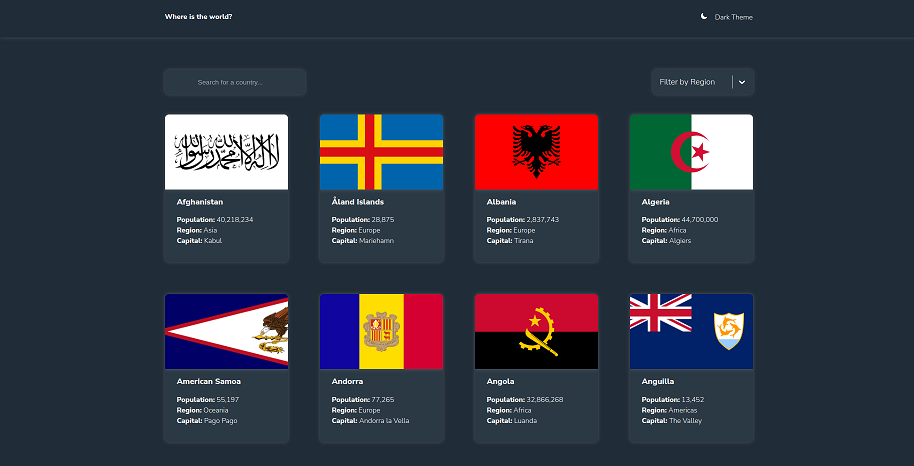
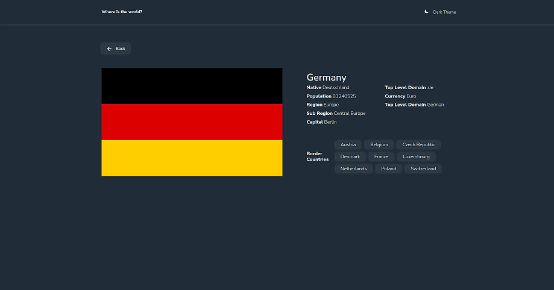
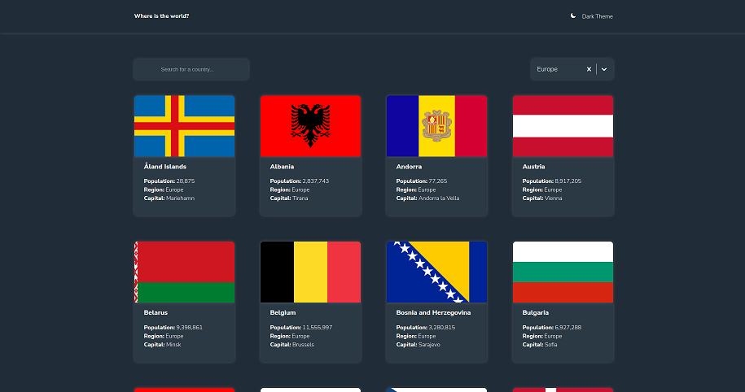

# Country App

An interactive country explorer app built with JavaScript and React.

# Project Overview

This application provides users with a searchable and filterable list of countries, where each country has detailed information, including:

- Flag: Visual representation of the country's flag.
- Population: Total population count.
- Currency: Primary currency used.
- Language(s): Official language(s) spoken.
- Capital: Capital city of the country.
- Region: Geographical region or continent.
- Bordering Countries: List of neighboring countries with clickable links for quick navigation.
- When a user clicks on a bordering country, they are taken to that country's detailed information page, making it easy to navigate through connected countries.

## Features

- Search for countries by name
- Filter countries by region or criteria
- View country details (flag, population, capital, etc.)
- Toggle between dark and light themes
- Click on neighboring countries to explore further

